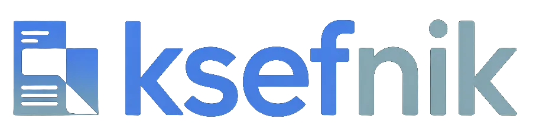

<p align="center">
  <a href="https://ksefnik.pl/">
    
  </a>
  &nbsp;&nbsp;&nbsp;
  <a href="https://codeformers.it/">
    
  </a>
</p>

<h1 align="center">Ksefnik — KSeF SDK dla TypeScript / Node.js z MCP serverem dla Claude i Cursor</h1>

<p align="center">
  Otwarte SDK do <strong>Krajowego Systemu e-Faktur (KSeF 2.0)</strong> — produkcyjny klient HTTP API, silnik reconcyliacji faktur z wyciągami bankowymi (MT940, mBank, ING, PKO BP, Santander) i <strong>Model Context Protocol server</strong>, który podpina polskie e-faktury bezpośrednio pod Claude Desktop, Cursor i innych agentów AI.
  <br /><br />
  <em>KSeF SDK · KSeF Node.js client · KSeF API · Polish e-Invoice API · National e-Invoice System library · KSeF TypeScript client · KSeF MCP server · e-faktura SDK · KSeF 2.0 client</em>
</p>

<p align="center">
  <a href="https://www.npmjs.com/package/@ksefnik/core"></a>
  &nbsp;
  <a href="https://www.npmjs.com/package/@ksefnik/mcp"></a>
  &nbsp;
  <a href="https://docs.ksefnik.pl/"></a>
  &nbsp;
  <a href="https://opensource.org/licenses/MIT"></a>
</p>

---

## O projekcie

**Ksefnik** to kompletne, otwarte SDK do **Krajowego Systemu e-Faktur (KSeF 2.0)** — obowiązkowego od 2026-02-01 systemu Ministerstwa Finansów do wystawiania i pobierania faktur elektronicznych w Polsce. Projekt rozwijany przez [CodeFormers.it](https://codeformers.it/) adresuje dwa problemy, które każdy deweloper integrujący się z KSeF musi rozwiązać: **produkcyjny klient HTTP do `api.ksef.mf.gov.pl`** (auth flow z challenge + RSA-OAEP, parsowanie FA(2)/FA(3), refresh tokenów, rate limiting) oraz **reconcyliacja faktur z wyciągami bankowymi** (6-stopniowy pipeline dopasowujący KSeF ↔ MT940/mBank/ING/PKO BP/Santander).

Jako jeden z pierwszych SDK-ów do polskiej e-faktury Ksefnik wystawia również **Model Context Protocol server** — dzięki czemu możesz rozmawiać z KSeF-em z poziomu Claude Desktop, Cursora, Continue albo dowolnego innego klienta MCP. Pobranie faktur kosztowych za marzec, import wyciągu z ING i uruchomienie reconcyliacji sprowadza się do jednego zdania w czacie z AI.

Projekt jest na wczesnym etapie rozwoju — API może się zmieniać między wersjami `0.x`. Od `1.0` obowiązuje semver.

## Funkcje

### Reconciliation Engine

Automatyczne dopasowywanie faktur KSeF do przelewow bankowych w 6 krokach: numer KSeF, dokladne dopasowanie NIP + kwota, numer faktury w tytule przelewu, przyblizone dopasowanie nazwy (fuzzy matching), platnosci czesciowe, dopasowanie bliskosci. [Dokumentacja →](https://docs.ksefnik.pl/silnik-uzgadniania/jak-dziala-pipeline/)

### Bank Parsers

Import wyciagow z polskich bankow: MT940 (standard), CSV z mBank, ING, PKO BP, Santander. Automatyczna detekcja formatu pliku. Ekstrakcja NIP z tytulow przelewow. [Dokumentacja →](https://docs.ksefnik.pl/parsery-bankowe/obslugiwane-formaty/)

### HTTP Adapter (`@ksefnik/http`)

Produkcyjny klient HTTP do KSeF 2.0 (`api.ksef.mf.gov.pl`). Pelny flow uwierzytelnienia (challenge + RSA-OAEP), pobieranie metadanych faktur, parsowanie FA(2)/FA(3) XML, ekstrakcja kwot brutto. Gotowy do podpiecia pod `createKsefnik()` przez `createHttpAdapter({ nip, token, environment, publicKeyPem })`. Szczegoly: [packages/http/README.md](packages/http/README.md). [Dokumentacja →](https://docs.ksefnik.pl/http/przeglad/)

### KSeF Simulator

Lokalny mock serwer KSeF do testow offline. Deterministyczny, bez polaczenia z Ministerstwem Finansow. Gotowe scenariusze: happy-path, timeout, odrzucenie faktury, wygasniecie sesji. [Dokumentacja →](https://docs.ksefnik.pl/symulator/happy-path/)

### MCP Server

Model Context Protocol server (9 narzedzi) do integracji z Claude i innymi asystentami AI. Reconcyliacja, import wyciagow i zapytania o faktury bezposrednio z poziomu AI. [Dokumentacja →](https://docs.ksefnik.pl/mcp/konfiguracja/)

### Walidacja faktur

Walidacja faktur przed wyslaniem do KSeF. Reguly biznesowe Ministerstwa Finansow z czytelnymi komunikatami bledow po polsku. [Dokumentacja →](https://docs.ksefnik.pl/walidacja/mechanizm/)

### Type-Safe SDK

Pelne typy TypeScript wygenerowane z oficjalnych schematow XSD KSeF. Bledy wychwytywane na etapie kompilacji, a nie w runtime.

## Instalacja

**Wymagania**: Node.js 22+, pnpm 9+

```bash
npm install @ksefnik/core @ksefnik/http
# lub
pnpm add @ksefnik/core @ksefnik/http
```

- `@ksefnik/core` — reconcyliacja, parsery bankow, walidacja (baza)
- `@ksefnik/http` — produkcyjny klient HTTP do KSeF 2.0 (wymagane do produkcji)
- `@ksefnik/simulator` — mock KSeF do testow offline (devDep)

```bash
npm install --save-dev @ksefnik/simulator
```

### Konfiguracja HTTP adaptera

```ts
import { createKsefnik } from '@ksefnik/core'
import { createHttpAdapter } from '@ksefnik/http'
import { readFileSync } from 'node:fs'

const adapter = createHttpAdapter({
  nip: '7010002137',
  token: process.env.KSEF_TOKEN!,
  environment: 'production',
  publicKeyPem: readFileSync('./ksef-public-key.pem', 'utf8'),
})

const ksef = createKsefnik({
  config: { nip: '7010002137', environment: 'production', token: process.env.KSEF_TOKEN! },
  adapter,
})

await adapter.initSession?.()
const invoices = await ksef.invoices.fetch({ from: '2026-03-01', to: '2026-03-31' })
await adapter.closeSession?.()
```

## Szybki start

> Pelny przewodnik krok po kroku: [docs.ksefnik.pl/wprowadzenie/szybki-start](https://docs.ksefnik.pl/wprowadzenie/szybki-start/)

```typescript
import { createKsefnik } from '@ksefnik/core'

const ksef = createKsefnik({
  nip: '1234567890',
  environment: 'test',
  token: process.env.KSEF_TOKEN
})

// Pobierz faktury z KSeF
const invoices = await ksef.invoices.fetch({
  dateFrom: '2026-03-01',
  dateTo: '2026-03-31'
})

// Zaimportuj wyciag bankowy
const transactions = await ksef.bank.import('./wyciag.mt940')

// Uruchom reconcyliacje
const report = await ksef.reconciliation.run({ invoices, transactions })

console.log(`Dopasowane: ${report.matched.length}`)
console.log(`Niedopasowane faktury: ${report.unmatchedInvoices.length}`)
console.log(`Niedopasowane przelewy: ${report.unmatchedTransactions.length}`)
```

## Architektura

> Szczegolowy opis architektury monorepo: [docs.ksefnik.pl/zaawansowane/architektura-monorepo](https://docs.ksefnik.pl/zaawansowane/architektura-monorepo/)

Ksefnik stosuje podejscie SDK-first -- cala logika biznesowa znajduje sie w pakiecie `core`, a pozostale pakiety (CLI, MCP server) sa cienkimi wrapperami, ktore z niego korzystaja.

```
ksefnik/
  packages/
    shared/       @ksefnik/shared      Typy Zod, interfejsy, plugin system
    core/         @ksefnik/core        Reconciliation engine, bank parsers, KSeF adapter
    http/         @ksefnik/http        Produkcyjny klient HTTP do KSeF API v2
    simulator/    @ksefnik/simulator   Offline KSeF test harness
    mcp/          @ksefnik/mcp         MCP server (wrapper na core)
    cli/          @ksefnik/cli         CLI (Commander.js), standalone binary via bun compile
```

| Pakiet | Opis |
|--------|------|
| `@ksefnik/shared` | Wspoldzielone typy Zod, interfejsy i plugin system |
| `@ksefnik/core` | Glowna logika: reconciliation engine, bank parsers, adapter KSeF |
| `@ksefnik/http` | Produkcyjny klient HTTP do KSeF 2.0 (auth RSA-OAEP, sesje, pobieranie faktur) |
| `@ksefnik/simulator` | Lokalny mock serwer KSeF do testow offline |
| `@ksefnik/mcp` | Model Context Protocol server -- integracja z AI |
| `@ksefnik/cli` | Interfejs wiersza polecen, kompilacja do standalone binary |

## MCP Server

MCP server udostępnia 9 narzędzi (reconcyliacja, import wyciągów, zapytania o faktury, walidacja, wysyłka, UPO) bezpośrednio z poziomu Claude Desktop, Cursor, Claude Code i innych klientów MCP.

### Claude Desktop

Dodaj do `claude_desktop_config.json` (`~/Library/Application Support/Claude/claude_desktop_config.json` na macOS):

```json
{
  "mcpServers": {
    "ksefnik": {
      "command": "npx",
      "args": ["-y", "@ksefnik/mcp"],
      "env": {
        "KSEF_NIP": "7010002137",
        "KSEF_TOKEN": "twoj-token-ksef",
        "KSEF_ENV": "test"
      }
    }
  }
}
```

### Cursor

Dodaj do `.cursor/mcp.json` w katalogu projektu:

```json
{
  "mcpServers": {
    "ksefnik": {
      "command": "npx",
      "args": ["-y", "@ksefnik/mcp"],
      "env": {
        "KSEF_NIP": "7010002137",
        "KSEF_TOKEN": "twoj-token-ksef",
        "KSEF_ENV": "test"
      }
    }
  }
}
```

### Claude Code

```bash
claude mcp add ksefnik -- npx -y @ksefnik/mcp
```

### Uruchomienie ręczne

```bash
npx @ksefnik/mcp
```

### Dostępne narzędzia

| Narzędzie | Opis |
|-----------|------|
| `sync-invoices` | Pobierz faktury z KSeF |
| `query-invoices` | Wyszukaj faktury |
| `import-bank` | Importuj wyciąg bankowy |
| `reconcile` | Uruchom reconcyliację |
| `get-unmatched` | Pokaż niedopasowane pozycje |
| `send-invoice` | Wyślij fakturę do KSeF |
| `validate-invoice` | Waliduj fakturę |
| `confirm-match` | Potwierdź dopasowanie |
| `get-upo` | Sprawdź status UPO (potwierdzenie odbioru) |

## Stack technologiczny

| Technologia | Zastosowanie |
|-------------|-------------|
| TypeScript (strict) | Jezyk programowania |
| Node.js 22 | Srodowisko uruchomieniowe |
| pnpm | Menedzer pakietow, workspace monorepo |
| Zod | Walidacja danych i definicja schematow |
| Vitest | Framework testowy |
| Commander.js | CLI framework |
| @clack/prompts | Interaktywne prompty CLI |
| @modelcontextprotocol/sdk | Implementacja MCP server |
| fuzzball | Fuzzy string matching |
| mt940js | Parser formatu MT940 |
| bun | Kompilacja CLI do standalone binary |

## Rozwoj

### Uruchomienie lokalne

```bash
git clone https://github.com/CodeFormers-it/ksefnik.git
cd ksefnik
pnpm install
pnpm build
```

### Testy

```bash
pnpm test           # uruchom wszystkie testy
pnpm test:watch     # tryb watch
```

### Wytyczne dla Pull Requestow

> Pelny przewodnik dla kontrybutorów: [docs.ksefnik.pl/zaawansowane/contributing](https://docs.ksefnik.pl/zaawansowane/contributing/)

1. Stworz branch z opisowa nazwa (`feat/partial-payments`, `fix/mt940-parser`).
2. Upewnij sie, ze wszystkie testy przechodza (`pnpm test`).
3. Dodaj testy dla nowej funkcjonalnosci.
4. Opisz zmiany w PR -- co, dlaczego i jak przetestowac.

Zapraszamy do zglaszania Issues i Pull Requestow. Projekt jest na wczesnym etapie, wiec kazdego rodzaju wklad jest mile widziany.

## Często zadawane pytania

### Jak pobrać faktury z KSeF w Node.js albo TypeScript?

Zainstaluj `@ksefnik/core` i `@ksefnik/http`, skonfiguruj `createHttpAdapter` z tokenem KSeF i kluczem publicznym MF, i woła `ksef.invoices.fetch({ from, to })`. Pełen przykład w sekcji [Szybki start](#szybki-start). Ksefnik jest w tej chwili jedynym produkcyjnym **KSeF SDK dla TypeScript / Node.js** z pełnym pokryciem flow uwierzytelnienia KSeF 2.0.

### Czy Ksefnik wspiera KSeF 2.0 (obowiązkowe API od 2026-02-01)?

Tak. Pakiet `@ksefnik/http` rozmawia bezpośrednio z `api.ksef.mf.gov.pl/v2`, implementuje pełen flow uwierzytelnienia (challenge + **RSA-OAEP SHA-256**, redeem, refresh) i parsuje faktury w formacie FA(2)/FA(3). Typy są generowane z oficjalnego OpenAPI MF, więc przy każdej zmianie kontraktu w MF masz breaking change na etapie kompilacji TypeScript.

### Jak zintegrować KSeF z Claude Desktop, Cursorem albo innym agentem AI?

Ksefnik wystawia pełny serwer **Model Context Protocol** (`@ksefnik/mcp`) z 8 narzędziami: pobieranie faktur z KSeF, import wyciągów bankowych, reconcyliacja, zapytania o niedopasowane pozycje, ręczne potwierdzanie matchów, walidacja i wysyłka. Konfiguracja Claude Desktop to 5 linii JSON-a w `claude_desktop_config.json` — szczegóły w sekcji [MCP Server](#mcp-server) i w [`@ksefnik/mcp`](packages/mcp/README.md). Jeżeli szukasz **KSeF MCP server** albo **KSeF Claude AI integration** — to jest to.

### Jak zautomatyzować dopasowanie faktur KSeF do wyciągu bankowego?

Silnik `@ksefnik/core` odpala 6-stopniowy pipeline reconcyliacji: referencja KSeF → NIP + dokładna kwota → numer faktury w tytule przelewu → fuzzy matching nazwy kontrahenta → płatności częściowe → proximity. Każdy match ma `score`, `strategy` i `confidence`, więc automatycznie wiesz, które dopasowania można zatwierdzić bez oglądania, a które skierować do ręcznej weryfikacji. Wspierane formaty wyciągów: **MT940** (SWIFT, wszystkie polskie banki), **mBank CSV**, **ING CSV**, **PKO BP CSV**, **Santander CSV**.

### Czy mogę testować integrację z KSeF offline, bez dostępu do `api-test.ksef.mf.gov.pl`?

Tak — `@ksefnik/simulator` to deterministyczny **offline mock KSeF** z gotowymi scenariuszami testowymi (happy-path, timeout, wygasła sesja, błąd walidacji NIP, opóźnione UPO). Implementuje dokładnie ten sam interfejs co `@ksefnik/http`, więc kod produkcyjny nie wie, że odpowiada mu mock. Idealny do CI w GitHub Actions — bez tokenów, bez sekretów, bez zależności od dostępności serwerów MF.

### Szukam biblioteki do KSeF w Pythonie — czy jest alternatywa w TypeScript?

Ksefnik jest natywnym **KSeF SDK w TypeScript** — działa w Node.js 22+, Next.js API routes, serverless (Vercel Functions, Lambda, Cloudflare Workers), długo żyjących workerach, CLI i jako MCP server dla agentów AI. Kwoty są trzymane jako integer grosze (bez floatów), modele domenowe są schematami Zod, kryptografia idzie przez `node:crypto` + `webcrypto.subtle` (zero zależności kryptograficznych trzecich).

### Jakie środowiska KSeF wspiera?

| Środowisko | Bazowy URL |
|---|---|
| `production` | `https://api.ksef.mf.gov.pl/v2` |
| `demo` | `https://api-demo.ksef.mf.gov.pl/v2` |
| `test` | `https://api-test.ksef.mf.gov.pl/v2` |

Środowisko ustawiasz flagą `--env` w CLI albo polem `environment` w `createHttpAdapter`. Domyślnie `test`, żeby nic nie wyszło na produkcję przypadkiem.

### Czy Ksefnik obsługuje wysyłkę faktur do KSeF, czy tylko odczyt?

W obecnej wersji MVP pełna wysyłka (asynchroniczny `POST /invoices/exports` + polling + UPO) jest jeszcze niepełna — `sendInvoice` w `@ksefnik/http` jest stubem. Pełne wsparcie wysyłki wchodzi w v0.1. **Pobieranie faktur, reconcyliacja, walidacja i integracja MCP działają produkcyjnie już dziś.**

## Licencja

MIT — darmowe dla wszystkich, do dowolnego zastosowania. Szczegóły w pliku [LICENSE](LICENSE).

---

<p align="center">
  <a href="https://codeformers.it/">
    
  </a>
</p>

<p align="center">
  Stworzone przez <a href="https://codeformers.it/">CodeFormers.it</a> -- software house specjalizujacy sie w TypeScript, automatyzacji i integracji systemow.
  <br /><br />
  <a href="https://codeformers.it/">codeformers.it</a>&nbsp;&nbsp;|&nbsp;&nbsp;<a href="https://codeformers.it/calculator/project-estimator/">Wycen projekt w 60 sekund</a>
</p>
